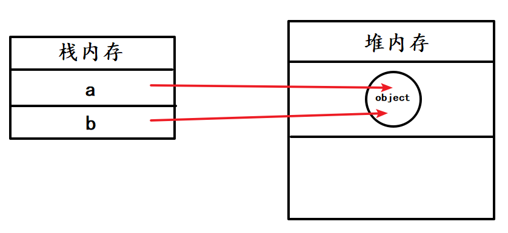

# JavaScript 基础

## 类型转换

在 JS 中类型转换只有三种情况，分别是：

- 转换为布尔值
- 转换为数字
- 转换为字符串


### 转 Boolean 类型

**undefined**、**null**、**false**、**NaN**、**''**、**0**、**-0**，转为 **false**，其他所有值都转为 **true**，**包括所有对象**。

### 四则运算符

:::tip
其他运算只要其中一方是**数字**，那么另一方就转为**数字**。
:::

**加法**运算符不同于其他几个运算符,它有以下几个特点：

- 运算中其中一方为**字符串**，那么就会把另一方也转换为**字符串**
- 如果一方不是字符串或者数字，那么会将它转换为**数字**或者**字符串**

```js
console.log(1 + '1') // '11'
console.log(true + true) // 2
console.log(4 + [1, 2, 3]) // "41,2,3"
console.log([1, 2] + [2, 1]) // '1,22,1'
```

:::tip 练习
**`4 + [1, 2, 3]`** : 其中一方不是字符串或者数字，则转换为数字或者字符串

- 将 **`[1, 2, 3]`** 转换为 **`'1, 2, 3'`** 字符串
- **`4 + '1, 2, 3'`** 右边是字符串，将左边的数字也转换为字符串
- **`'4' + '1, 2, 3' = '41, 2, 3'`**

**`[1, 2] + [2, 1]`** : 其中一方不是字符串或者数字，则转换为数字或者字符串

**`[1, 2] + [2, 1]`** 转化为字符串，**`'1, 2' + '2, 1' = '1, 22, 1'`**
:::

对于加号需要注意这个表达式 `'a' + + 'b'`

`'a'` 是字符串，将右边 `+ 'b'` 转为数字，`+ 'b'` ---> NaN

**NaN** 不是字符串也不是数字，转换为 `'NaN'` 字符串

`'a' + NaN = 'aNaN'`、

有个小技巧就是将一些数字型的字符串转为 **number** 类型，如 `+ '1' = 1`

除了加法运算，只要其中一方是数字，那么另一方就会被转成数字

```js
console.log(4 * '3') // 12
console.log(4 * []) // 0
console.log(4 * [1, 2]) // NaN
```

### == 操作符

## 深浅拷贝

基本数据类型保存在`栈内存`，引用类型保存在`堆内存`中

如果是基本数据类型，赋值的时候，会在栈内存中重新开辟一块空间，两者修改后互不影响

```js
let a = 1

let b = a

a = 2

console.log(a) // 2
console.log(b) // 1
```

而赋值引用类型的时候，修改其中一个则会影响到另一个

以下是对象

```js
let a = {
  age: 1
}

let b = a
a.age = 2

console.log('a.age', a.age) // 2
console.log('b.age', b.age) // 2
```

以下是数组

```js
let arr = [1, 2, 3]

let brr = arr

arr.push(4) // 使用 push、splic、pop、shift、unshift 均会更改

console.log(arr) // [ 1, 2, 3, 4 ]
console.log(brr) // [ 1, 2, 3, 4 ]
```

因为 a 和 b 都指向同一个引用，所以将 a 更改后，b 也跟着更改



在开发中会遇到既要保留原始数据，又要更改新数据，如果只是单纯的改变值，我们可以使用浅拷贝

### 浅拷贝

对象的解决方法：

1、通过 `Object.assign()` 来解决

```js {5}
let a = {
  age: 1
}

let b = Object.assign({}, a)

a.age = 2
console.log('a.age', a.age) // 2
console.log('b.age', b.age) // 1
```

2、通过 ES6 的展开运算符 `{...}`

```js {5}
let a = {
  age: 1
}

let b = { ...a }

a.age = 2
console.log('a.age', a.age) // 2
console.log('b.age', b.age) // 1
```

数组的解决方法：

1、通过 `concat()` 来解决

**concat** 方法不会改变 **this** 或任何作为参数提供的数组，而是返回一个**浅拷贝**，它包含与原始数组相结合的相同元素的副本，原始数组的元素将复制到**新数组**中。[MDN 上对 concat 的描述](https://developer.mozilla.org/zh-CN/docs/Web/JavaScript/Reference/Global_Objects/Array/concat)

```js {3}
let arr = [1, 2, 3]

let brr = arr.concat()

arr.push(4)
console.log(arr) // [ 1, 2, 3, 4 ]
console.log(brr) // [ 1, 2, 3 ]
```

2、通过 `slice()` 来解决

`slice()` 方法返回一个新的数组对象，这一对象是一个由 **begin** 和 **end**（不包括 end）决定的原数组的**浅拷贝**,原始数组不会被改变。[MDN 上对 slice 的描述](https://developer.mozilla.org/zh-CN/docs/Web/JavaScript/Reference/Global_Objects/Array/slice)

```js {3}
let arr = [1, 2, 3]

let brr = arr.slice()

arr.push(4)
console.log(arr) // [ 1, 2, 3, 4 ]
console.log(brr) // [ 1, 2, 3 ]
```

其实这两种方法都是返回一个新的数组，所以改变其中一个数组并不会影响另一个

浅拷贝只能解决一层引用的问题，如果是多层则会失败

```js {8,10}
let a = {
  age: 1,
  city: {
    name: 'fz'
  }
}

let b = Object.assign({}, a)

a.city.name = 'sz'

console.log('a.city.name', a.city.name) // sz
console.log('b.city.name', b.city.name) // sz
```

有多层引用的时候就要使用深拷贝

### 深拷贝

通常可以使用 JSON.parse(JSON.stringify(object)) 来解决

```js {8,13}
let a = {
  age: 1,
  city: {
    name: 'fz'
  }
}

let b = JSON.parse(JSON.stringify(a))

a.city.name = 'sz'

console.log('a.city.name', a.city.name) // sz
console.log('b.city.name', b.city.name) // fz
```

但是该方法也是有局限性的：

- 会忽略 undefined
- 会忽略 symbol
- 不能序列化函数
- 不能解决循环引用的对象

```js
let a = {
  w: function() {},
  x: undefined,
  y: Object,
  z: Symbo
let b = JSON.stringify(a)
console.log(b) // '{}'

JSON.stringify([undefined, Object, Symbol('')])
// '[null,null,null]'
```

undefined、任意的函数以及 symbol 值，在序列化过程中会被忽略（出现在非数组对象的属性值中时）或者被转换成 null（出现在数组中时）

[MDN 上对 JSON.stringify 的描述](https://developer.mozilla.org/zh-CN/docs/Web/JavaScript/Reference/Global_Objects/JSON/stringify)

不过这种解决方案可以解决大部分问题，并且该函数是内置函数中处理深拷贝性能最快的

如果想实现更好的深拷贝，可以使用 **lodash** 函数库

```js
var obj1 = {
  a: 1,
  b: { f: { g: 1 } },
  c: [1, 2, 3]
}
var obj2 = _.cloneDeep(obj1)
console.log(obj1.b.f === obj2.b.f) // false
```

也可以手动递归拷贝（较为麻烦）

```js
var obj1 = {
  a: 1,
  b: {
    f: {
      g: 1
    }
  },
  c: [1, 2, 3]
}

function getType(obj) {
  // tostring 会返回对应不同的标签的构造函数
  var toString = Object.prototype.toString
  var map = {
    '[object Boolean]': 'boolean',
    '[object Number]': 'number',
    '[object String]': 'string',
    '[object Function]': 'function',
    '[object Array]': 'array',
    '[object Date]': 'date',
    '[object RegExp]': 'regExp',
    '[object Undefined]': 'undefined',
    '[object Null]': 'null',
    '[object Object]': 'object'
  }
  // 判断是否为 DOM 元素
  if (obj instanceof Element) {
    return 'element'
  }
  return map[toString.call(obj)]
}

function deepClone(data) {
  var type = getType(data)
  var obj
  if (type === 'array') {
    obj = []
  } else if (type === 'object') {
    obj = {}
  } else {
    //不再具有下一层次
    return data
  }
  if (type === 'array') {
    for (var i = 0, len = data.length; i < len; i++) {
      obj.push(deepClone(data[i]))
    }
  } else if (type === 'object') {
    for (var key in data) {
      obj[key] = deepClone(data[key])
    }
  }
  return obj
}

let obj2 = deepClone(obj1)
obj1.b.f.g = 2
console.log(obj2) // 不会改变
```

## Map、Filter、Reduce

`Map` 的作用是生成一个**新数组**，遍历原数组，将数组中的元素进行一些变换后放入新数组中

```js
let array = [1, 2, 3]
let b = array.map(v => v + 1) // [2, 3, 4]
```

`Map` 接收三个参数，分别是**当前索引元素**、**索引值**、**原数组**

```js
let array = ['1', '2', '3']
let b = array.map(parseInt) // [ 1, NaN, NaN ]
```

- 第一轮遍历  parseInt('1', 0) -> 1
- 第二轮遍历  parseInt('2', 1) -> NaN
- 第三轮遍历  parseInt('3', 2) -> NaN

`Filter`  的作用也是生成一个**新数组**，在遍历数组的时候**将返回值为  true  的元素**放入新数组，我们可以利用这个函数删除一些不需要的元素

```js
let array = [1, 2, 4, 6]
let newArray = array.filter(v => v !== 6)
console.log(newArray) // [ 1, 2, 4 ]
```

和  `Map`  一样，`Filter`  的回调函数也接受三个参数，用处也相同。

`Reduce` 可以将数组中的元素通过**回调函数**最终转换为一个值。

如果要实现一个将函数里的元素全部相加得到一个值，可能会这样写

```js
const arr = [1, 2, 3]
let total = 0
for (let i = 0; i < arr.length; i++) {
  total += arr[i]
}
console.log(total) // 6
```

使用 `Reduce` 的话就可以将遍历部分的代码优化为一行代码

```js
const arr = [1, 2, 3]
const sum = arr.reduce((acc, current) => acc + current, 0) // 6
```

对于  `Reduce`  来说，它接受**两个参数**，分别是**回调函数**和**初始值**，接下来我们来分解上述代码中  `Reduce`  的过程

1. 首先初始值为  0，该值会在执行**第一次回调函数**时作为**第一个参数**传入
2. 回调函数接受四个参数，分别为**累计值**、**当前元素**、**当前索引**、**原数组**，这里着重分析第一个参数
3. 在第一次执行回调函数时，当前值和初始值相加得出结果 1，该结果会在**第二次执行回调函数**时当做**第一个参数传入**
4. 所以在第二次执行回调函数时，相加的值就分别是  1  和 2，以此类推，循环结束后得到结果  6

当然 `Reduce` 还可以实现很多功能，接下来我们就通过  `Reduce`  来实现  `Map`  函数

```js
const arr = [1, 2, 3]
const mapArray = arr.map(value => value * 2)
const reduceArray = arr.reduce((acc, current) => {
  acc.push(current * 2)
  return acc
}, [])
console.log(mapArray, reduceArray) // [ 2, 4, 6 ] [ 2, 4, 6 ]
```

- 第一次执行的时候，将 **[]** 空数组作为第一个参数传入，即 **acc = []** ，然后执行回调函数，`acc.push(current \* 2)` 这里 **acc = []**，**current = 1** ，执行完后，**acc = [2]**，**return acc**

- 第二次执行的时候，将第一次执行的结果作为第一个参数传入，即 **acc = [2]** ，再执行 `acc.push(current \* 2)` ，这时的 **current = 2** ，结果 **acc = [2，4]**，返回 acc

- 第三次执行的时候，再将第二次执行的结果作为第一个参数传入，即 **acc = [2，4]**，再执行 `acc.push(current \* 2)` ，这时的 **current = 3**，结果 **acc = [2，4，6]** ，返回 acc ，reduce 函数执行结束
