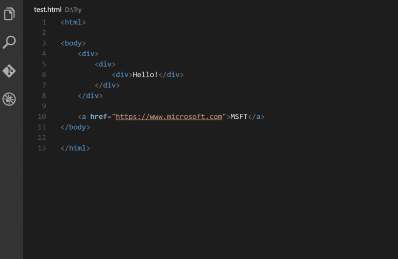
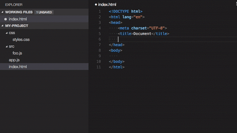
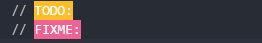
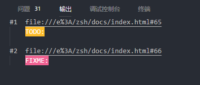
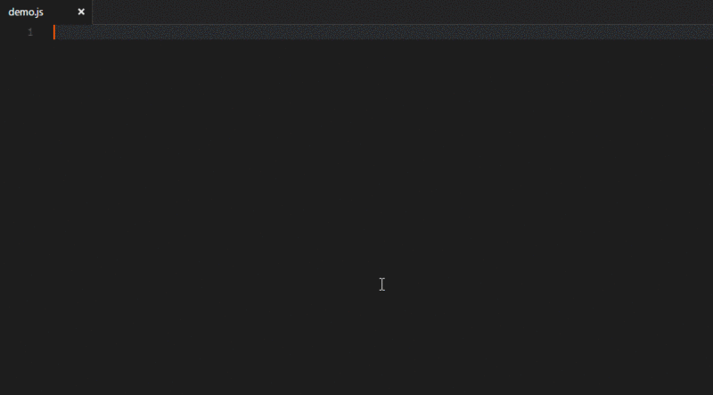
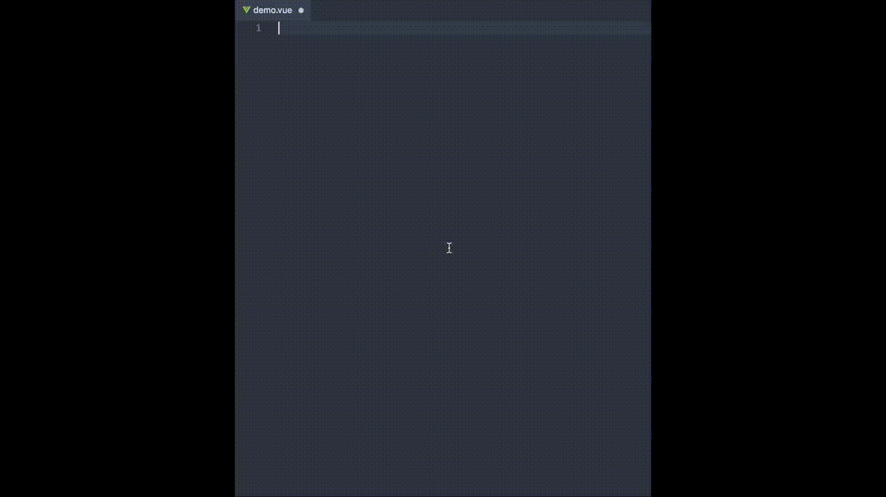
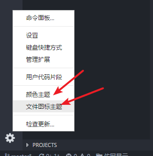
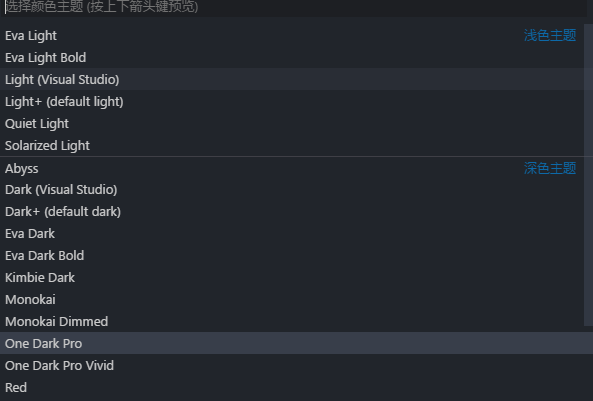
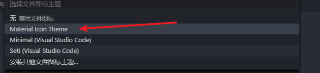

# 通用插件

## Auto Close Tag

自动添加 HTML / XML 关闭标签（必备）


## Auto Rename Tag

自动重命名配对的 HTML / XML 标签(必备)



## Bracket Pair Colorizer

颜色识别匹配括号,彩虹色


## Code Runner

非常强大的一款插件，能够运行多种语言的代码片段或代码文件：C，C ++，Java，JavaScript，PHP，Python，Perl，Ruby，Go 等等，安装完成后，右上角出现:


或者选中某一段代码右键选择 Run Code 单独运行


## CSS Peek

能够查看 CSS ID 和类的字符串作为 HTML 文件中相应的 CSS 定义（必备）


## ESLint

语法规范插件

在 vscode 的系统设置中添加一下代码：

```js
"files.autoSave":"off",
"eslint.validate": [
    "javascript",
    "javascriptreact",
    "html",
    { "language": "vue", "autoFix": true }
],
"eslint.options": {
    "plugins": ["html"]
}
```

## JavaScript(ES6) code snippets

ES6 代码片段(必备)

## open-in-browser

在浏览器中预览 HTML 文件, Firefox 和 谷歌浏览器和 IE 浏览器

打开 HTML 文件，快捷键为 Ctrl+ Alt+ O

## Path Intellisense1

自动路径补全



## TODO Highlight

用法: TODO、FIXME 后面加上冒号



技巧:

查找整个目录中所有标注 TODO 和 FIXME 的地方

```bash
Ctrl + P , 输入 >TODO-Highlight:List hilighted annotations , 选择 ALL
```



## vscode-fileheader

顶部注释模板，可定义作者、时间等信息，并会自动更新最后修改时间

在 vscode 的设置中配置作者名

```js
// 文件头注释代码段设置
"fileheader.Author": "zsh",

"fileheader.LastModifiedBy": "zsh",
```

> 快捷键: Ctrl + Alt + i



# Vue 插件

## Vetur

语法高亮、智能感知、Emmet 等，以下是我的配置

```js
 //格式化.vue中html
"vetur.format.defaultFormatter.html": "js-beautify-html",

 //让vue中的js按编辑器自带的 ts 格式进行格式化
"vetur.format.defaultFormatter.js": "vscode-typescript",

"vetur.format.defaultFormatterOptions": {
    "js-beautify-html": {
      "wrap_attributes": "force-aligned" //属性强制折行对齐
    }
},
```

## Vue VSCode Snippets

Vue 代码段



具体语法看官网：https://marketplace.visualstudio.com/items?itemName=sdras.vue-vscode-snippets

## One Dark Pro

暗色系主题





## Material Icon Theme

好看的图标




## 未完待续

<!-- # 系统设置

```js
"files.insertFinalNewline": true, // 文件末尾空行

"files.trimTrailingWhitespace": true, // 启用后，将在保存文件时剪裁尾随空格

"files.trimFinalNewlines": true, // 启用后，保存文件时将删除在最终新行后的所有新行。

"editor.fontSize": 14, //字体大小

"editor.formatOnSave": true, //每次保存自动格式化
```

# 我的设置

```js
{
  "workbench.colorTheme": "One Dark Pro Vivid",
  "workbench.iconTheme": "material-icon-theme",
  "git.autofetch": true,
  // 文件头注释代码段设置
  "fileheader.Author": "zsh",
  "fileheader.LastModifiedBy": "zsh",
  "cosmosDB.showSavePrompt": false,
  "files.autoSave": "off",
  // "materialTheme.fixIconsRunning": false,
  // projectManager项目管理插件 打开新窗口
  "projectManager.openInNewWindowWhenClickingInStatusBar": true,
  "gitlens.advanced.messages": {
    "suppressLineUncommittedWarning": true,
    "suppressShowKeyBindingsNotice": true
  },
  // 同步的设置
  // "gitlens.historyExplorer.enabled": true,
  "terminal.integrated.rendererType": "dom",
  "sync.gist": "286126f42a5486070637ba754bfd6b0c",
  "sync.quietSync": false,
  "sync.askGistName": false,
  "sync.removeExtensions": true,
  "sync.syncExtensions": true,
  "sync.autoDownload": false,
  "sync.autoUpload": false,
  "sync.forceDownload": false,
  // vscode 配置
  "files.insertFinalNewline": true, // 文件末尾空行
  "files.trimTrailingWhitespace": true, // 启用后，将在保存文件时剪裁尾随空格
  "files.trimFinalNewlines": true, // 启用后，保存文件时将删除在最终新行后的所有新行。
  "editor.fontSize": 14, //字体大小
  "editor.formatOnSave": true, //每次保存自动格式化
  // 格式化设置
  "eslint.autoFixOnSave": true, // 每次保存的时候将代码按eslint格式进行修复
  "vetur.format.defaultFormatter.html": "js-beautify-html", //格式化.vue中html
  "vetur.format.defaultFormatter.js": "vscode-typescript", //让vue中的js按编辑器自带的ts格式进行格式化
  // "vetur.format.defaultFormatter.js": "prettier", //使用 prettier 风格
  "vetur.format.defaultFormatterOptions": {
    "js-beautify-html": {
      "wrap_attributes": "force-aligned" //属性强制折行对齐
    }
  },
  "prettier.eslintIntegration": true, //让prettier使用eslint的代码格式进行校验
  "prettier.semi": false, //在代码结尾加上分号
  "prettier.singleQuote": true, //使用带引号替代双引号
  "eslint.validate": [
    //开启对.vue文件中错误的检查
    "javascript",
    "javascriptreact",
    {
      "language": "html",
      "autoFix": true
    },
    {
      "language": "vue",
      "autoFix": true
    }
  ],
  // 将终端切换为 git
  "terminal.integrated.shell.windows": "F:\\Git\\bin\\bash.exe",
  // "terminal.integrated.shell.windows": "C:\\WINDOWS\\System32\\WindowsPowerShell\\v1.0\\powershell.exe",
  // element 配置
  "element-helper.language": "zh-CN",
  "element-helper.version": "2.4",
  "element-helper.indent-size": 2,
  "element-helper.quotes": "double", // html vue qoutes
  "element-helper.pug-quotes": "single", // jade/pug quotes
  "javascript.format.insertSpaceBeforeFunctionParenthesis": false, // 函数前保留空格
  // css 设置
  "editor.quickSuggestions": {
    "other": true,
    "comments": true,
    "strings": true
  },
  "css.remoteStyleSheets": [
    "https://maxcdn.bootstrapcdn.com/bootstrap/4.0.0-alpha.6/css/bootstrap.min.css"
  ],
  "material-icon-theme.showWelcomeMessage": false,
  "files.associations": {
    "*.cjson": "jsonc",
    "*.wxss": "css",
    "*.wxs": "javascript"
  },

  "minapp-vscode.disableAutoConfig": true,
  "workbench.sideBar.location": "left",
  "window.menuBarVisibility": "default",
  "workbench.activityBar.visible": true,
  "editor.minimap.enabled": true,
  "editor.renderWhitespace": "none",
  "editor.renderControlCharacters": false,
  "breadcrumbs.enabled": true,
  "javascript.updateImportsOnFileMove.enabled": "always",
  // mpvue 关闭检查
  "vetur.validation.template": true,
  // emmet 设置
  "emmet.includeLanguages": {
    "wxml": "html",
    "vue-html": "html",
    "vue": "html",
    "javascriptreact": "html",
    "typescript": "html",
    "javascript": "javascriptreact"
  },
  "emmet.showSuggestionsAsSnippets": true,
  "emmet.triggerExpansionOnTab": true,
  "editor.tabSize": 2,
  "editor.tabCompletion": "on",
  "editor.formatOnPaste": true,
  "editor.formatOnType": false,
  "gitlens.views.fileHistory.enabled": true,
  "gitlens.views.lineHistory.enabled": true
}
``` -->
