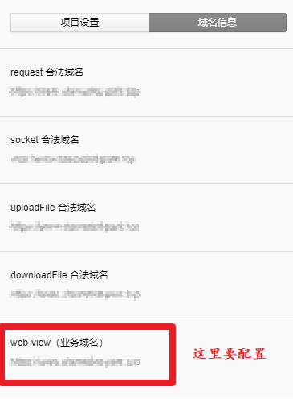
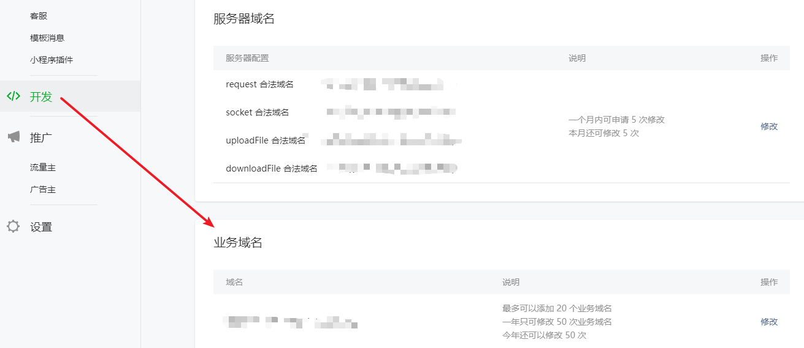
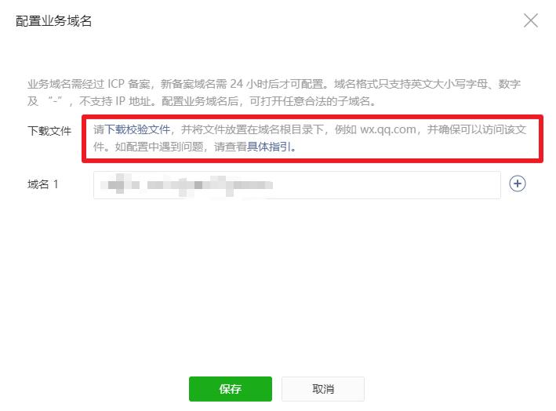
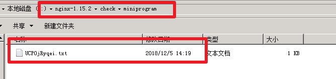
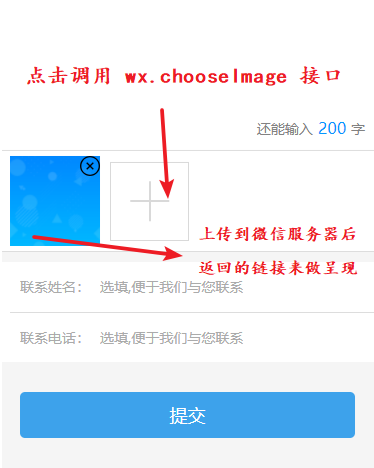
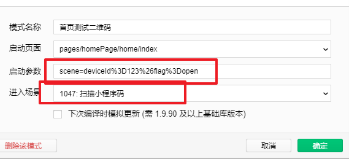

# 小程序 😃

## button 组件

#### 默认样式更改及点击样式更改

按钮的默认样式会有边框，如果项目中不需要默认边框，可以在全局样式 app.wxss 中加上，也可以局部设置

```css
/* 全局 button */
button::after {
  border: 0;
}

/* 局部 */
.test button::after {
  border: 0;
}
```

通过**属性选择器**来自定义禁用后的样式

```css
.other[disabled] {
  background: linear-gradient(
    to right,
    rgba(16, 103, 233, 0.8),
    rgba(16, 142, 233, 0.6)
  );
  box-shadow: 0 1rpx 6rpx 2rpx rgba(16, 103, 233, 0.7);
  color: rgba(0, 0, 0, 0.2);
}
```

---

#### 自定义按钮点击时的样式

::: warning 注意！
如果设置了按钮的 type 属性，如 `type="primary"` ,则无法自定义成功，必须删除 `type` 属性，`hover-class` 的类名默认值为 `button-hover`
:::

```html
<!-- 自定义点击样式类 -->
<button hover-class="other-button-hover">primary</button>
```

```css
/** 修改 button 默认的点击态样式类**/
.button-hover {
  background-color: red;
}

/** 添加自定义 button 点击态样式类**/
.other-button-hover {
  background-color: blue;
}
```

## web-view 组件的坑

在小程序中可以通过 `web-view` 标签可以跳转到 `H5` 页面

::: warning 注意！
`web-view` 不能在个人申请的小程序中使用，必须是公司主体申请的小程序

公众号的 `openId` 和小程序的 `openId` 是 **不一样** 的，要在 **微信开放平台** 绑定公众号和小程序以后，根据 `openId` 去获取的 `unionid` 是一致的
:::

::: danger 报错！
如果报错信息为：不支持打开非业务域名 `www.xxx.com` 请重新配置的解决方案：
:::

在微信开发者工具中可以查看是否有配置 `web-view` 的业务域名



---

#### 域名配置及校验

在小程序中配置业务域名



<!--  -->

下载官方提供的校验文件

<!--  -->



将下载的文件放到服务器中，这里我使用 `nginx`

新建 `check/miniprogram` 文件夹，将下载的文件放进去



设置 `nginx.conf` 文件

```xml
server{
	listen 80;
	server_name www.xxx.com; #你的域名

	#miniprogram
	location /UCP0jRyqei.txt { #文件的相对路径
    root   check/miniprogram;  #文件夹的路径
    index  index.html index.htm;
  }
}
```

配置成功后，访问 `http://www.xxxx.com/xxxx.txt` ，你的域名 + 文件名，如果有成功返回，说明配置成功

再去小程序的业务域名里保存域名，即可在小程序中通过 `web-view` 去访问网页 😝

---

#### web-view 跳转公众号授权网页

目前公司业务需要在小程序中通过 `web-view` 去网页中授权公众号

所以这个 H5 页面就是用户获取 `code`，拿到 `code` 给服务端，从而获取用户的公众号 `openId`

```html
<web-view
  wx:if="{{authorize}}"
  bindmessage="msgHandler"
  src="https://open.weixin.qq.com/connect/oauth2/authorize?appid=XXX&redirect_uri=https://www.XXX.com/GZHLogin.html&response_type=code&scope=snsapi_base&state=STATE#wechat_redirect"
></web-view>
```

以上代码段中的 `appid` 和 `https` 的地址需要替换

在 **H5** 页面中往小程序发送数据，使用 `postMessage` 接口

```js
wx.miniProgram.postMessage({ data: { gzhOpenId: res.data.openId } })
```

在 `web-view` 中设置属性 `bindmessage` 来接受网页返回的数据

```js
msgHandler(e) {
  console.log('网页回来的数据 gzhOpenId', e.detail.data) //我是网页，获取到来自页面的数据
  if (e.detail.data[0].gzhOpenId) {
    console.log('有 gzhOpenId', e.detail.data[0].gzhOpenId)
    wx.setStorageSync('gzhOpenId', e.detail.data[0].gzhOpenId)
  }
},
```

:::tip
网页向小程序 **postMessage** 时，会在 **特定时机**（小程序后退、组件销毁、分享）触发并收到消息。并不是从 h5 页面一返回就会立刻接收到数据 😣
:::

`H5` 页面中的完整代码：

```html
<!DOCTYPE html>
<html lang="en">
  <head>
    <meta charset="UTF-8" />
    <meta name="viewport" content="width=device-width, initial-scale=1.0" />
    <meta http-equiv="X-UA-Compatible" content="ie=edge" />
    <title></title>
    <script src="./jweixin-1.4.0.js"></script>
  </head>
  <body></body>
  <script>
    function _GetQueryString(paraName) {
      var url = decodeURI(document.location.toString())
      var arrObj = url.split('?')
      if (arrObj.length > 1) {
        var arrPara = arrObj[1].split('&')
        var arr
        for (var i = 0; i < arrPara.length; i++) {
          arr = arrPara[i].split('=')
          if (arr != null && arr[0] === paraName) {
            return arr[1]
          }
        }
        return ''
      } else {
        return ''
      }
    }
    // 判断是否在小程序环境
    wx.miniProgram.getEnv(function(res) {
      console.log('判断是否在小程序环境')
      console.log(res.miniprogram) // true
      if (res.miniprogram === true) {
        var str = location.href
        console.log('str', str)
        var code = _GetQueryString('code')
        var appid = _GetQueryString('appid')
        var data = JSON.stringify({
          code: code,
          appid: appid
        })
        console.log('data', data)
        var xhr = new XMLHttpRequest()
        xhr.withCredentials = true
        xhr.open('POST', '/basicServer/wechat/mp/getWxMpServiceByMaAppIdByBase')
        xhr.setRequestHeader('Content-Type', 'application/json')
        xhr.setRequestHeader('cache-control', 'no-cache')
        xhr.send(data)
        xhr.onreadystatechange = function() {
          // 这步为判断服务器是否正确响应
          if (xhr.readyState == 4 && xhr.status == 200) {
            console.log('请求返回响应成功')
            console.log(xhr.responseText)
            var res = JSON.parse(xhr.responseText)
            // 第一层应该是 data,不能写成 wx.miniProgram.postMessage({openId: res.data.openId })
            // 往小程序传递公众号 openId
            wx.miniProgram.postMessage({ data: { gzhOpenId: res.data.openId } })
            // 跳转回小程序
            wx.miniProgram.reLaunch({
              url: '/pages/homePage/login/index'
            })
          } else {
            console.log('请求未返回响应失败')
            wx.miniProgram.reLaunch({
              url: '/pages/homePage/login/index'
            })
          }
        }
      }
    })
  </script>
</html>
```

在修改 `web-view` 显示渲染状态的时候，不能使用 `this.setData({})` 来加锁 ，也不能使用 `wx.setStorageSync()` 加锁，最后是设置全局变量 `app.globalData` 实现的

## Page 传递对象及接收外部参数

1. 先将要传的对象通过 `JSON.stringify` 转义为字符串后拼接到 `URL` 上

```js
const details = JSON.stringify(e.currentTarget.dataset.details)
const dataType = this.properties.dataType

wx.navigateTo({
  url: `/pages/my/repairDetails/index?dataType=${dataType}&details=${details}`
})
```

2. 到跳转的页面上接收转义的对象变量

```js
onLoad: function(options) {
  let details = JSON.parse(options.details)
  console.log('details', details)
  var stringTime = details.effectiveEndTime
  let effectiveEndTime = transformationDate(stringTime, 1)
  this.setData({
    details,
    effectiveEndTime,
    monthAmount: details.monthAmount
  })
}
```

如果只是接收字符串的参数，则不用转义：

```js
onLoad: function(options) {
  let id = options.id
  console.log('id', id)
}
```

## 小程序更新机制

1. 小程序的启动方式：

- 冷启动：小程序首次打开或销毁后再次被打开
- 热启动：小程序打开后，在一段时间内（目前：5 分钟）再次被打开，此时会将后台的小程序切换到前台。

2. 根据以上两种启动方式，相应的更新机制为：

小程序**冷启动**时，会检查小程序是否有最新版本。

如果有则将异步下载最新版本，但是仍将运行当前版本，等到下一次冷启动时再运行最新版本。

如果你想现在就使用最新版本则需要调用 wx.getUpdateManager API 进行处理

3. API 介绍

```js
// 获取全局唯一的版本更新管理器，用于管理小程序更新。
const updateManager = wx.getUpdateManager()

//   updateManager 对象的方法列表：
onCheckUpdate(function(res) {}) // 当向微信后台请求完新版本信息，会进行回调
onUpdateReady() // 当新版本下载完成，会进行回调
onUpdateFail() // 当新版本下载失败，会进行回调
applyUpdate() // 当新版本下载完成，调用该方法会强制当前小程序应用上新版本并重启
```

```js {4,8,15,20}
// 获取小程序更新机制是否兼容
if (wx.canIUse('getUpdateManager')) {
  const updateManager = wx.getUpdateManager()
  updateManager.onCheckForUpdate(function(res) {
    console.log('res', res)
    // 请求完新版本信息的回调
    if (res.hasUpdate) {
      updateManager.onUpdateReady(function() {
        wx.showModal({
          title: '更新提示',
          content: '新版本已经准备好，是否重启应用？',
          success: function(res) {
            if (res.confirm) {
              // 新的版本已经下载好，调用 applyUpdate 应用新版本并重启
              updateManager.applyUpdate()
            }
          }
        })
      })
      updateManager.onUpdateFailed(function() {
        // 新的版本下载失败
        wx.showModal({
          title: '已经有新版本了哟~',
          content: '新版本已经上线啦~，请您删除当前小程序，重新搜索打开哟~'
        })
      })
    }
  })
} else {
  // 如果希望用户在最新版本的客户端上体验您的小程序，可以这样子提示
  wx.showModal({
    title: '提示',
    content: '当前微信版本过低，无法使用该功能，请升级到最新微信版本后重试。'
  })
}
```

## 分享功能

按钮的 `open-type` 属性值设置为 `share`，即可触发 `onShareAppMessage` 函数

```html
<button class="button-type" open-type="share" hover-class="none">
  分享给好友
</button>
```

```js
  /**
   * 用户点击右上角分享
   */
  onShareAppMessage: function(res) {
    let that = this
    if (res.from === 'button') {
      // 来自页面内转发按钮
      console.log(res.target)
    }
    return {
      title: '钥匙分享', // 分享的标题名称
      imageUrl: that.data.qrCode, // 分享后出现的图片，可以自定义
      path: `pages/homePage/home/index?deviceId=${that.data.key}&flag=share`
      // 用户点击分享后跳转的地址及携带的参数
    }
  }

```

## 多张图片上传及表单提交

#### 调用 wx.chooseImage 接口

要上传图片之前，得先选择图片，通过调用 wx.chooseImage 接口，接口返回的数据中有图片的链接，再呈现到页面中即可



```html
<!-- 这里是用 weui 的上传图片样式，设定最多三张 -->
<view class="weui-uploader__input-box btn-line" wx:if="{{pics.length !== 3}}">
  <view class="weui-uploader__input" bind:tap="uploadImg"></view>
</view>
```

对应的 `uploadImg` 方法示例：

```js
// 上传图片到微信服务器
uploadImg() {
  let that = this
  let pics = that.data.pics
  if (pics.length === 3) {
    wx.showToast({
      title: '最多只能三张图片',
      icon: 'none',
      image: '',
      duration: 1500,
      mask: false
    })
    return
  }
  wx.chooseImage({
    count: 3, // 最多可以选择的图片总数
    sizeType: ['compressed'], // 可以指定是原图还是压缩图，默认二者都有
    sourceType: ['album', 'camera'], // 可以指定来源是相册还是相机，默认二者都有
    success: function(res) {
      // 返回选定照片的本地文件路径列表，tempFilePath 可以作为 img 标签的 src 属显示图片
      let tempFilePaths = res.tempFilePaths
      pics = pics.concat(tempFilePaths)
      that.setData({
        pics
      })
    }
  })
},
```

#### 携带图片及表单数据一起提交后台

```js
/**
 * 先上传图片，拿到图片的路径后再提交表单
 */
onSubmit() {
  let that = this
  // 没上传图片，则直接提交表单数据
  if (tempFilePaths.length === 0) {
    // 调后台提交表单接口
    SubmitApi(list).then(res => {
      wx.showToast({
        title: '提交成功',
        icon: 'success',
        duration: 2000
      })
    })
  } else {
    for (var i = 0 ; i < tempFilePaths.length; i++) {
      // 将图片上传到自己的后台服务器
      wx.uploadFile({
        url: config.api_base_url + 'goodsServer/picture/uploadHeadImg',
        filePath: tempFilePaths[i],
        name: 'file', // 后端规定的名称
        formData: {
          imgIndex: i
        },
        header: {
          'Content-Type': 'multipart/form-data',
          'x-auth-token': wx.getStorageSync('x-auth-token') // 调用接口的 token ，根据情况删除/修改
        },
        success: function (res) {
          wx.showToast({
            title: '正在上传第' + (uploadImgCount + 1) + '张'
          })
          uploadImgCount++ // 每次传完后计数
          var data = JSON.parse(res.data)
          // 将服务器返回的七牛云图片地址存入
          imgArr.push(data.data)
          // 如果是最后一张, 则隐藏 showToast ，并且调用提交表单的接口
          if (uploadImgCount === tempFilePaths.length) {
            wx.hideToast()
            that.data.list.imageUrl = imgArr.toString()
            // 图片地址及表单数据一起提交给后台
            SubmitApi(list).then(res => {
              wx.showToast({
                title: '提交成功',
                icon: 'success',
                duration: 2000
              })
            })
          }
        },
        fail: function (res) {
          wx.hideToast()
          wx.showModal({
            title: '错误提示',
            content: '上传图片失败',
            showCancel: false,
            success: function (res) { }
          })
        }
      })
    }
  }
}

```

#### 删除图片

```js
deleteImg: function(e) {
  var pics = this.data.pics
  var index = e.currentTarget.dataset.index
  pics.splice(index, 1)
  this.setData({
    pics: pics
  })
},
```

## wx.switchTab 注意事项

:::tip
wx.switchTab: url 不支持 `queryString`，也就是无法通过 `url + ? + 参数` 的形式来传递参数
:::

1. 通过**全局变量**的方式存储数据
2. 通过**缓存**来存储

如果不是常用的数据，无需通过缓存，直接用全局变量的方式存储就可以了

在最外层的 `app.js` 文件中定义 **全局变量**

```js {3}
App({
  onLaunch: function() {},
  globalData: {
    userInfo: null
  }
})
```

在页面中引入并使用全局变量

```js {1}
var app = getApp() // 引入全局 App
Page({
  // 使用
  onLoad: function(options) {
    console.log(app.globalData.userInfo) // 输出全局变量中的值
  }
})
```

在 `wx.switchTab` 的 `success` 回调函数中，要执行一次刷新操作，`page.onLoad()` 不然拿不到值

```js {6}
wx.switchTab({
  url: '../home/index',
  success: function() {
    var page = getCurrentPages().pop()
    if (page == undefined || page == null) return
    page.onLoad()
  }
})
```

## 小程序进入场景分析

#### 微信开发者工具模拟调试

先选择进入场景，然后将参数放在 `scene=` 的后面



:::warning 注意！

这里要转义特殊字符

:::

| 符号 |          解释          | 转义 |
| ---- | :--------------------: | ---: |
| #    | 用来标志特定的文档位置 |  %23 |
| %    |   对特殊字符进行编码   |  %25 |
| &    |   分隔不同的变量值对   |  %26 |
| +    |   在变量值中表示空格   |  %2B |
| /    |      表示目录路径      |  %2F |
| \    |      表示目录路径      |  %5C |
| =    |     用来连接键和值     |  %3D |
| ?    |  表示查询字符串的开始  |  %3F |
| 空格 |          空格          |  %20 |
| .    |          句号          |  %2E |
| :    |          冒号          |  %3A |


#### 获取小程序码中的参数

```js
// scene 需要使用 decodeURIComponent 才能获取到生成二维码时传入的 scene
console.log('用户扫码进入', decodeURIComponent(options.scene))
```

## 自定义事件

在小程序**组件**中，使用 `this.triggerEvent('事件名',{'属性'},{})`

```js
this.triggerEvent('test',{data: 'a'},{})
```

在 Page 中使用自定义组件的时候，需要绑定自定义事件

```html
<v-test bind:test="onTest"></v-test>
```

```js
onTest(event) {
  console.log(event.detail.data) // 通过自定义事件，将组件的值传递给 page
}
```

详情见官方文档： [组件事件](https://developers.weixin.qq.com/miniprogram/dev/framework/custom-component/events.html)


## 用 promise 封装 wx.request

Promise 优势：多个异步等待合并

Promise 是一个对象，不是一个函数，对象是可以保存状态的

Promise 有三种状态，`pending` `fulfilled` `rejected` ，进行中、已成功、已失败

在 `new Promise` 的时候就是处于 `pending` 状态，通过 `reslove` 和 `reject` 把一个进行中的 `promise` 修改为**已成功**或者**已失败**的状态

一旦将状态修改为已成功或者已失败， **promise** 的状态就凝固了，不能再改变

```js
const promise = new Promise((resLove, reject) => {
  wx.getSystemInfo({
  success: res reslove(res),
  fail: error reject(error)
  })
})

promise.then(
  res => {
    console.log(res)
  },
  error => {
    console.log(error)
  }
)
```
